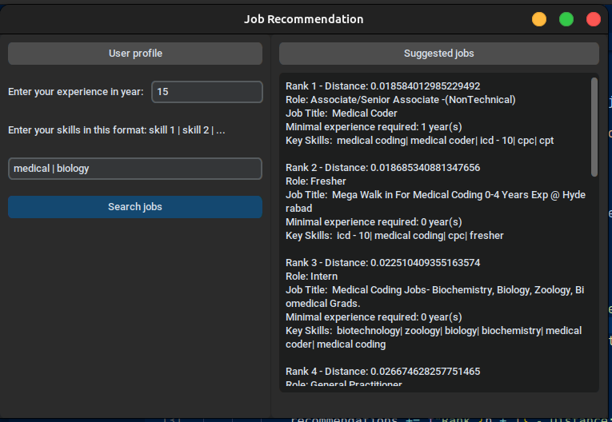
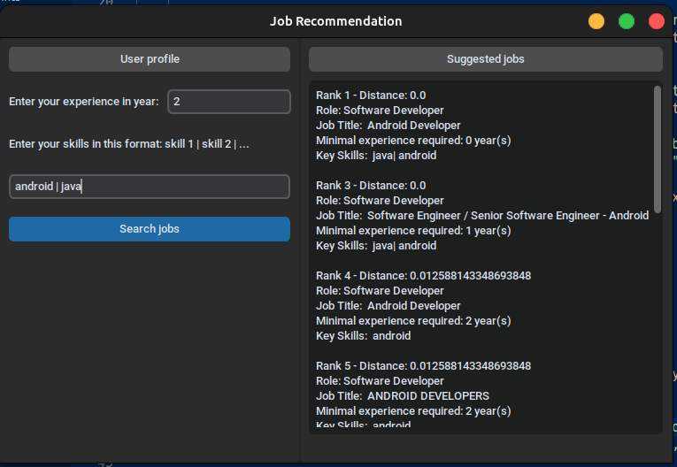

# Job Recommendation System

**Author**: *Mathias Hersent*

## How to run the program

1. First install all the dependencies needed with

`pip install -r requirements.txt`

2. Run the main program

`python3 main.py`

## Documentation

1. **The dataset**

I found my dataset on kaggle. [This dataset](https://www.kaggle.com/datasets/promptcloud/jobs-on-naukricom?resource=download) was made from data mining and web scraping and it has the following fields:

- *Uniq Id* (not used)
- *Crawl Timestamp* (not used)
- *Job Title*
- *Job Salary* (not used because there is a lot of missing values)
- *Job Experience Required* (min - max years)
- *Key Skills* (format: "skill1 | skill2 | ...")
- *Role Category* (not used)
- *Location* (not used)
- *Functional Area* (not used)
- *Industry* (not used)
- *Role* (Type of job like: "R&D Executive", "Technical Support Engineer", etc...)

Concerning preprocessing, I just dropped some useless columns and remove rows with empty values. I also reformated the column *Job Experience Required* to only keep the minimal experience required.

2. **Methodology / Algorithms**

I tried 2 methods to find recommendations. For both I used TF-IDF to transformed the **Key Skills** into a format usable by the algorithms.

My first approach was with a simple KNN model, the goal was to find the k nearest jobs giving the skills the user input transformed with TF-IDF. But it dindn't work really well because the recommended jobs were not relevants.

After that, I tried a different approach using deep-learning. I trained a very basic neural network following this architecture:

- Input layer (approximatly 4000 parameters)
- 1st Hidden Layer (256 parameters)
- 2nd Hidden Layer (64 parameters)
- Output layer (number of unique **Role**)

The input of the neural network is the **Key Skills** tranformed with TF-IDF and the output is the **Role** of the jobs (for examples: Sales Executive/Officer, R&D Executive, Testing Engineer, Media Planning Executive/Manager, etc...).

But this neural network was not sufficient to give me a list of recommended jobs base on the input of the user because it only predicts a *Role*, so in order to obtain a list, I used a KNN model on the data given by the last hidden layer of my neural network by cutting the output layer.

So with this solution when a user inputs a list of skills I transform it with TF-IDF and then put it through my neural network to keep the data given by the last hidden layer (a vector of size 64) and with that I can use my KNN model to find the k nearest (transformed) jobs and it works really well comparing with just a simple KNN model on the data just transformed by TF-IDF.

3. **Results**

From my experiments, the results are really good, here are some examples screenshots:

## Challenges and Improvements

I think that the main challenges was to get relevant input from user, from the example you gaves us, the input was directly a CV in PDF format, it is a very complex input. For this task I only used a list of skills and the experience in years, an improvement could be to add other entries...

An other improvement could be to have a more complete database to have more relevant jobs to propose.